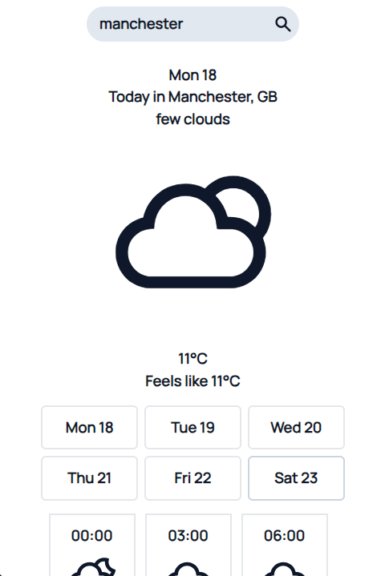

#WeatherApp - Your Weather Information App

WeatherApp, powered by React, delivers detailed weather updates for cities worldwide. Users can search for any city to access the 3-hourly weather forecast for the next 6 days, including current conditions. Intuitive icons simplify weather representation for quick understanding.

**Note**: WeatherApp fetches real-time weather data using a weather API to provide accurate and up-to-date information.

## Features

WeatherApp offers an array of features to enhance your movie exploration:

- **Search by City**:  Easily search for weather information for any city.
- **3-Hourly Forecast**: View the weather forecast in 3-hour intervals for the next 6 days.
- **Current Weather**: Get real-time weather conditions for the specified city..
- **Weather Conditions with Icons:**: Weather conditions are represented with intuitive icons (e.g., sunny, cloudy, rainy).
- **Date and Day**: Each forecast entry includes the date and day of the week for easy reference.

## Technologies Used

- **React**: For building the user interface.
- **React Router**: For app navigation.
- **Tailwind CSS**: For styling.
- **JavaScript**: For functionality.
- **React Query**: For data fetching.
- **Vite**: For fast development.
  
## Screenshots




## Getting Started

To get started with the project, follow these steps:

1. **Clone the repository:**

   ```sh
   git clone https://github.com/ozergklp/MovieHub.git
   cd MovieHub
2. **Install dependencies:**

   ```sh
   npm install
3. **Start the development server:**

   ```sh
   npm run dev 
# Weather App
https://weather-six-gilt.vercel.app

